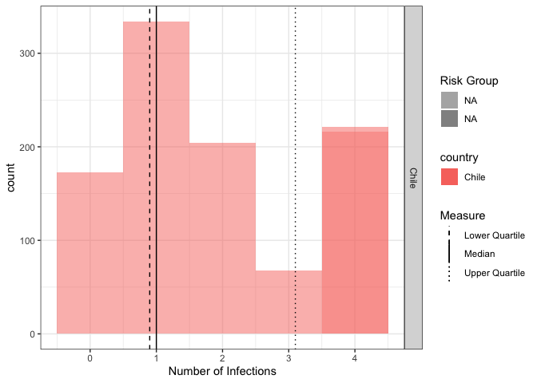

<!-- README.md is generated from README.Rmd. Please edit that file -->

# What does this code do?

Now we have refactored the code it should now be more clear that it
takes summary parameters for a country and from this generates a
synthetic population of individuals stratified into high and low risk
groups with a disease that has multiple strains and is immunising (with
no cross protection by strain). The code then provides tools for
calculating summary statistics for the number of infections per
individual and provides a summary plot stratified by country.

# How have we reorganised the code?

We moved each step of the code into functions (stored in the `R` folder)
aiming to capture the smallest possible unit of analysis (here this is
by country). For longer steps we introduced multiple internal functions
each of which plays a single role. This results in the following code
structure:

-   synthesize a population (`synthesize_population.R`),
-   extract features from that population in an analysis
    (`aggregate_dataframe.R` and `calculate_quantiles.R`),
-   and finally visualize the synthetic population + analysis results
    (`plot_infections.R`).

On top of moving to a functional approach we have also wrapped our new
functions in a light R package (using `usethis` to help us). This means
that we now have dependency management via the `DESCRIPTION` file, a
standard layout from which to work, and infrastructure for documentation
and testing.

As documentation is generally a helpful step for any refactor we have
also made use of `roxygen` comments to document each of our new
functions as well as providing examples highlighting how they work
individually.

# How have we refactored the code

As noted in the reorganisation section we have taken a highly functional
approach to refactoring and keeping DRY in mind have made functions at
the lowest level of analysis.

We have also introduced whitespace throughout and in general tried to
keep to a single operation per line at most.

To make understanding the inputs easier we have also updated the
required input schema so that the arguments match the arguments of the
`synthesize_population` function.

To make it clear where the functions we are using are imported from and
to avoid import a large number of functions we have adapted the code to
use the `package::function` style throughout.

# How have we reimplemented the multiple country workflow

Below we provide a simple workflow for a single input (which has now
been renamed to match the function it is calling). We also provide a
`targets` based workflow (see `_targets.Rmd` for more on this) to run
the full analysis across an arbitary number of countries (specified as
`json` in the input folder) with caching for each interim step
(i.e. they only update if a dependency has changed).

There are many other workflows that would be considered best practice
here. For more complex projects we might also want to consider a
workflow management tools such as `targets` or `Make`. The key is
focussing on verifiability, repeatability, generalisability, and
maintainability. We could also have expanded on this example by
including tests, more documentation, a vignette, and perhaps a
`Dockerfile`.

# How to use this repository

To use quick start below and to work through the examples you will first
need to have the repository locally. Once this is the case set your work
directory to the root of the repository. You can then use the following
to install the packages this repository depends on and load the package.

``` r
install.packages("devtools")
devtools::install_deps()
devtools::load_all()
```

After using `devtools::load_all()` to load the package, you can use the
inbuilt help functionality to learn more about the functions
(`?<function name>`).

# Anaylsis for a single input

-   Read the parameters for a single country

``` r
library(jsonlite) # for reading json files
library(here) # for finding files relative to project root
#> here() starts at /Users/seabbs/Downloads/badtobetter/better
params <- read_json(here("input/chile.json"))
params
#> $country
#> [1] "Chile"
#> 
#> $prob_high_risk
#> [1] 0.2
#> 
#> $prob_exposure_hr
#> [1] 0.8
#> 
#> $prob_exposure_lr
#> [1] 0.05
```

-   Synthesize a population with 4 strains of an infectious disease
    using the parameters we just read-in.

``` r
library(badtobetter)
pop <- do.call(badtobetter::synthesize_population, params)
```

-   Summarise the population.

``` r
pop_sum <- aggregate_dataframe(outcome ~ 1, pop, calculate_quantiles)
pop_sum
#>   outcome.lo.q outcome.med outcome.hi.q
#> 1            1           1            3
```

-   Plot the number of infections by risk group per individual in the
    population.

``` r
plot <- plot_infections(pop)
add_summary_to_infections_plot(plot, pop_sum)
#> Warning in labels(...): NAs introduced by coercion
```


